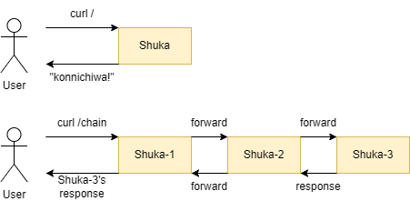

# Shuka - 朱歌

Ứng dụng Web đơn giản, sử dụng để triển khai thử nghiệm chuỗi SFC trên Kubernetes và đánh giá ảnh hưởng của Service Mesh tới SFC.


## 1. Giới thiệu

Shuka là ứng dụng Web đơn giản, có thể sử dụng như một Single Service hỗ trợ học tập triển khai ứng dụng trên Kubernetes. Shuka hỗ trợ khả năng ghép nhiều Module lại tạo thành một chuỗi SFC. 

## 2. Hướng dẫn

### 2.1. Biến môi trường

| Env Variable | Description | Default |
| --- | --- | --- |
| TARGET | Kết quả trả về khi thực hiện HTTP request tới URI / | Konnichiwa |
| PORT | Cổng hoạt động của Webserver | 80 |
| NEXT | khi thực hiện HTTP request tới URI /chain hoặc /chain/<param>, request sẽ được chuyển tiếp tới địa chỉ NEXT. Nếu không chỉ định gì sẽ chuyển tiếp tới chính khối Shuka hiện tại vào URI / | "" |
| PODNAME | Tên của Pod chạy Shuka, được truyền vào qua file .yaml | "" |
| NODENAME | Tên của Node chạy Shuka, được truyền vào qua file .yaml | "" |
| THREADS | Số luồng được Shuka dùng để xử lí requests | "8" |

### 2.2. URIs and Functions

Để có thể dễ nhận thấy các gói tin của Shuka trên Wireshark, các request và response đi giữa các khối Shuka với nhau và từ Shuka trả về đều được thêm trường **app: shuka** trong HTTP header

| URI | Function | Description |
| --- | --- | --- |
| / | index() | trả về giá trị **TARGET**, request trả về |
| /chain | chain () | chuyển tiếp request tới khối Shuka tiếp theo, được cấu hình trong **NEXT**. Khi request đi đến cuối chuỗi Shuka, **chain()** gọi tới **index()** |
| /chain/&lt;tag> | chain_tag(tag: str) | tương tự như /chain, nhưng request chuyển tiếp được thêm trường **tag: $tag** trong HTTP header. example: /chain/edge, HTTP header sẽ có thêm trường **tag: edge**
| /hometag/&lt;tag> | home_tag(tag: str) | khi đến cuối chuỗi Shuka, **chain_tag()** sẽ gọi tới **home_tag()** thay vì **index()**
| /sleep/&lt;sleepTime> | sleep(sleepTime: str) | thời gian Shuka-chan ngủ (fake request processing), tính bằng miliseconds

### 2.3. Build Docker image

```bash
cd src
docker build -t <docker_repo>/shuka:<tag> .
docker push <docker_repo>/shuka:<tag>
```

### 2.4. Using as Single Service

Khi sử dụng Shuka như một Single Service, chỉ có một khối Shuka được deploy. Chỉ có URI / có ý nghĩa sử dụng trong trường hợp này. Không cấu hình biến `NEXT`. Tham khảo mẫu triển khai Single service Shuka trên Kubernetes tại [shuka.yaml](k8s/shuka.yaml)

### 2.5. Using as SFC

Khi sử dụng Shuka như một chuỗi SFC, cần cấu hình biến `NEXT` trỏ tới `ip:port` của khối Shuka tiếp theo. Khối cuối cùng sẽ được đánh dấu bằng việc không cấu hình biến `NEXT`



Tham khảo mẫu triển khai SFC Shuka với 3 khối trên Kubernetes tại [shuka-san.yaml](k8s/shuka-san.yaml). Trong mẫu ví dụ, `NEXT` không có địa chỉ cổng vì mặc định Shuka lắng nghe trên cổng 80.

Tham khảo mẫu triển khai SFC Shuka với 3 khối trên 3 cổng khác nhau cùng localhost tại [example](example/)

### 2.6. Deploy in Istio

Shuka được dùng để thử nghiệm ảnh hưởng của Service Mesh lên một chuỗi SFC trước khi áp dụng vào chuỗi SFC trong [Knative](https://knative.dev). Tham khảo mẫu triển khai Shuka trên Istio với 2 Virtual Service shuka-2-edge và shuka-2-cloud tại [shuka-san-istio.yaml]()

## 3. Used Technology

Programming Language: Python (Flask)

## 4. Contributeur

Đào Hiệp - Bonavadeur - ボナちゃん  
Phòng nghiên cứu Mạng máy tính Future Internet Laboratory, Phòng 618 Thư Viện Tạ Quang Bửu, Đại học Bách Khoa Hà Nội  
未来のインターネット研究室, タコアンビュ図書館の６１８、ハノイ百科大学、ベトナム。  


## 5. History

v1.3 - Shuka threads  
v1.2 - Shuka sleep  
v1.1 - Add env variable PODNAME and NODENAME  
v1.0 - Shuka with plugable ability to other Shuka  